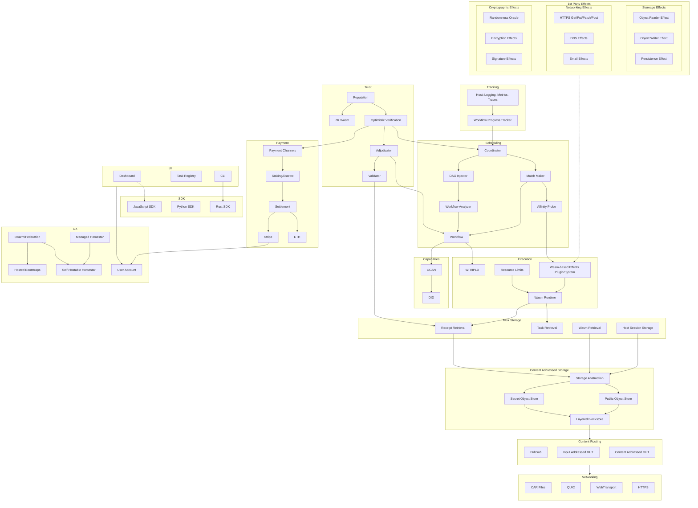

# Roadmap

Refer to the [Homestar Starmap] for the latest detailed roadmap.

## High Level Dependencies

<!-- External Links -->

[Homestar Star Map]: https://starmap.site/roadmap/github.com/ipvm-wg/Homestar/issues/321)https://starmap.site/roadmap/github.com/ipvm-wg/Homestar/issues/321
