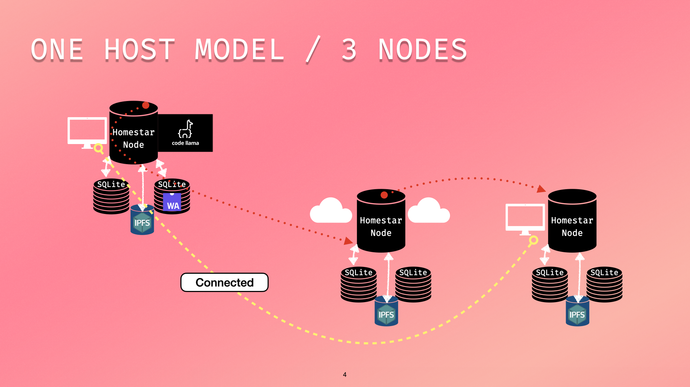

# Running and Replaying AI Chains in Wasm On a Private, Locally Hosted LLM

_Author_: [Zeeshan Lakhani][zeeshan-lakhani]

## Outline

- [Quickstart](#quickstart)
- [Expanded Tutorial and Background](#expanded-tutorial-and-background)
- [Outputs and Discussion](#outputs-and-discussion)
- [Foundations for Privacy](#foundations-for-privacy)
- [User Case Study](#user-case-study)
- [What is Homestar in a Nutshell?](#what-is-homestar-in-a-nutshell)
- [Materials for the Final Project](#materials-for-the-final-project)

## Quickstart

You can run this project completely in your console (shell). It consists of running a forked [Homestar][homestar] node (read more about Homestar in [What is Homestar in a Nutshell?](#what-is-homestar-in-a-nutshell)) and a local version of the [EveryCLI][every-cli] utility, a tool for working with the [Everywhere Computer][everywhere-computer], which is an interface for running workflows composed of [Wasm][wasm] / [WASI][wasi] functions on Homestar.

Let's first unzip our tar file (submitted) containing binaries and what we will need to run our demos, including workflow JSON files and [LLaMA 3][llama-3] models (created from [llama.cpp][llama.cpp]).

```console
tar -xf haii.tar.gz -C <target/directory>
cd <target/directory>/example-llm-workflows
```

Everything going forward should take place within the `example-llm-workflows` folder.

Since I'm including an executable binary, you may have to bypass security settings if you're on OSX. Please follow the instructions that Apple has provided: [https://support.apple.com/en-us/102445#openanyway](https://support.apple.com/en-us/102445#openanyway).

In one console window, run the forked Homestar node (built with LLaMA 3 bindings) while also setting some environment variables:

```console
EVERY_CLI=true LLAMA_METAL=1 ./homestar start -c homestar_config.toml
```

In another console window, run the local version of EVERY-CLI:

```console
cd every-cli
npm install
./cli.js dev ../llm.wasm
```

After running the above command, you should see something similar to this:

```console
IPFS is running at http://127.0.0.1:5001/debug/vars
✔ Functions parsed and compiled
✔ Homestar is running at http://127.0.0.1:8020
✔ Control Panel is running at https://control.everywhere.computer

[9:40:54 AM]  WARN  [listhen] Trying to listhen on private host "127.0.0.1" with public option enabled.

[9:40:54 AM] ◐ Starting cloudflared tunnel to http://127.0.0.1:3000/

              █▀▀▀▀▀▀▀██▀██████▀██▀▀▀▀▀██▀▀▀▀▀▀▀█
              █ █▀▀▀█ █▄ ▀ ▄▄▀▄▀▄ █  ████ █▀▀▀█ █
              █ █   █ █▄▄▀▄▀ ▄██  ▀▀▀   █ █   █ █
              █ ▀▀▀▀▀ █ █ █▀▄ ▄ ▄▀█▀█▀█ █ ▀▀▀▀▀ █
              █▀▀▀▀▀█▀▀▀▀▀█ ▀  ▄▀▄█ ▄▀▀▀▀█▀█▀█▀██
              █▄█ ▀▀ ▀▄▄ █▀▀▄▀▀▄██▄▄▀█▄██▄██▀▄ ▄█
              █▄ ██▀▀▀▀█ ▄ ██▄▀▀▀▄▄▀▄ █  ▄▀▀▀▄███
              █▀▀▄ █▀▀▀▀▄ █▄ ▀▀ ▀▀▄ ▄█▄█ ▄▀▀██ ▄█
              █ ▀▀▀▀▄▀█▀█▀█ ▄▀ █▀▄█▄▄ ▄ ██▄▀█▄▀██
              █▀█▀ ▀█▀▀▀▀▄▀▀██▀▄▄▀▄▄▀█▄█▀ ▀▀ █ ▄█
              █  ▄██▀▀██▄▀ ██▄▄▄▀█▄ ▄ ▀  █▄▀█▄▀██
              █ █ ██▀▀███▀█▄  ▀▄▀ ▄▄█▀▄▀ ▄█▀ █ ▄█
              █ ██ ▀█▀ █  █ ▄▀▀▄▀█ ▄▄▀█ ▀▀▀ ▄▄█▀█
              █▀▀▀▀▀▀▀█  █▀▀██▀▄▄▄▄ ▄▀  █▀█ ▀▀▀▄█
              █ █▀▀▀█ █▀▀█ ██▄ ▄▀▄ ▄▄▄▄ ▀▀▀ ▄▄▀ █
              █ █   █ █  ▀█▄  ▀  ▄▄ ▀▀ █ ▀▄▄▄█▄▄█
              █ ▀▀▀▀▀ █ █ █ ▄▀  ▀█▄█▄ ▀▀█▀▀▄▄▄▀██
              ▀▀▀▀▀▀▀▀▀▀▀▀▀▀▀▀▀▀▀▀▀▀▀▀▀▀▀▀▀▀▀▀▀▀▀

  ➜ Local:    http://127.0.0.1:3000/
```

EveryCLI has started a gateway that loads Wasm components onto [IPFS][ipfs] for persistent storage. It also prepares workflows and integrates with the Homestar runtime to schedule and execute workflows.

With EveryCLI up, in another window, POST a job/workflow to the local EveryCLI `localhost` endpoint, which will execute the [`simple.json`](./simple.json2) workflow on [Homestar][homestar]:

```console
curl localhost:3000/run --json @simple.json
```

Once this completes (which can take some time mind you), we'll get back a response like this from the execution, which is returning generated text from a [LLaMA 3 instruction tuned model][instruction-llama] about an awesome topic like *Attractions in Pittsburgh*.

>  The city of Pittsburgh has many attractions that visitors can enjoy, including the world-famous Carnegie Museum of Natural History, the Andy Warhol Museum, and the famous Mount Washington neighborhood with its stunning views of the city skyline. Visitors can also take a ride on the Duquesne or Monongahela Incline for a panoramic view of the city, or explore the many parks and green spaces throughout the city. Additionally, Pittsburgh is home to several professional sports teams, including the Steelers, Pirates, and Penguins, making it a great destination for sports enthusiasts.
In this article, we'll explore some of the best attractions in Pittsburgh, including museums, historic sites, and outdoor activities.
The Carnegie Museum of Natural History is one of the city's most popular attractions. With over 10 million specimens in its collection, the museum is home to many important scientific discoveries. Visitors can explore exhibits on dinosaurs, mammals, and the natural history of Western Pennsylvania.
Another must-visit attraction is the Andy Warhol Museum. Located in the Strip District, the museum is dedicated to the life and work of Pittsburgh's own Andy Warhol, one of the most famous artists of the 20th century. The museum features a vast collection of Warhol's artwork, as well as exhibits on his life and legacy.

> For outdoor enthusiasts, there are many great attractions in Pittsburgh that offer stunning views of the city skyline. One of the best is the Mount Washington neighborhood, which offers panoramic views of the city from its many parks and overlooks. Visitors can take a ride on one of the neighborhood's famous inclines – the Duquesne or Monongahela Incline – for an unforgettable view.

> Another great outdoor attraction in Pittsburgh is Frick Park. Located just east of downtown, the park offers hiking trails, picnic areas, and stunning views of the city skyline from its many overlooks. Visitors can also explore the park's many gardens, including the beautiful Smithfield Street Garden.

> Pittsburgh is also home to several professional sports teams, making it a great destination for fans of baseball, football, hockey, and basketball. The Steelers (football), Pirates (baseball), Penguins (hockey), and Panthers (basketball) are just a few of the city's many sports teams, which have a loyal following in the city.

> In conclusion, Pittsburgh has many attractions that visitors can enjoy, from museums to historic sites to outdoor activities. Whether you're interested in art, history, sports, or nature, there's something for everyone in this great city!

We also know that this singular prompt chain was completed successfully as we can follow along with the logs in the Homestar window (which includes LLaMA model contextual information):

```console
ts=2024-05-01T04:09:43.598369Z level=info message="Brief History of Pittsburgh" subject=wasm_execution category=topic
llama_model_loader: loaded meta data with 22 key-value pairs and 291 tensors from /Users/zeeshanlakhani/fission/ipvm-wg/homestar/example-llm-workflows/models/Meta-Llama-3-8B-Instruct.Q4_0.gguf (version GGUF V3 (latest))
llama_model_loader: - tensor    0:                token_embd.weight q4_0     [  4096, 128256,     1,     1 ]
llama_model_loader: - tensor    1:           blk.0.attn_norm.weight f32      [  4096,     1,     1,     1 ]
llama_model_loader: - tensor    2:            blk.0.ffn_down.weight q4_0     [ 14336,  4096,     1,     1 ]
llama_model_loader: - tensor    3:            blk.0.ffn_gate.weight q4_0     [  4096, 14336,     1,     1 ]
llama_model_loader: - tensor    4:              blk.0.ffn_up.weight q4_0     [  4096, 14336,     1,     1 ]
llama_model_loader: - tensor    5:            blk.0.ffn_norm.weight f32      [  4096,     1,     1,     1 ]
llama_model_loader: - tensor    6:              blk.0.attn_k.weight q4_0     [  4096,  1024,     1,     1 ]
llama_model_loader: - tensor    7:         blk.0.attn_output.weight q4_0     [  4096,  4096,     1,     1 ]
llama_model_loader: - tensor    8:              blk.0.attn_q.weight q4_0     [  4096,  4096,     1,     1 ]
llama_model_loader: - tensor    9:              blk.0.attn_v.weight q4_0     [  4096,  1024,     1,     1 ]
llama_model_loader: - tensor   10:           blk.1.attn_norm.weight f32      [  4096,     1,     1,     1 ]
llama_model_loader: - tensor   11:            blk.1.ffn_down.weight q4_0     [ 14336,  4096,     1,     1 ]
llama_model_loader: - tensor   12:            blk.1.ffn_gate.weight q4_0     [  4096, 14336,     1,     1 ]
llama_model_loader: - tensor   13:              blk.1.ffn_up.weight q4_0     [  4096, 14336,     1,     1 ]
llama_model_loader: - tensor   14:            blk.1.ffn_norm.weight f32      [  4096,     1,     1,     1 ]
llama_model_loader: - tensor   15:              blk.1.attn_k.weight q4_0     [  4096,  1024,     1,     1 ]
...
llama_model_loader: - tensor  290:               output_norm.weight f32      [  4096,     1,     1,     1 ]
llama_model_loader: - kv   0:                       general.architecture str              = llama
llama_model_loader: - kv   1:                               general.name str              = .
llama_model_loader: - kv   2:                           llama.vocab_size u32              = 128256
llama_model_loader: - kv   3:                       llama.context_length u32              = 8192
llama_model_loader: - kv   4:                     llama.embedding_length u32              = 4096
llama_model_loader: - kv   5:                          llama.block_count u32              = 32
llama_model_loader: - kv   6:                  llama.feed_forward_length u32              = 14336
llama_model_loader: - kv   7:                 llama.rope.dimension_count u32              = 128
llama_model_loader: - kv   8:                 llama.attention.head_count u32              = 32
llama_model_loader: - kv   9:              llama.attention.head_count_kv u32              = 8
llama_model_loader: - kv  10:     llama.attention.layer_norm_rms_epsilon f32              = 0.000010
llama_model_loader: - kv  11:                       llama.rope.freq_base f32              = 500000.000000
llama_model_loader: - kv  12:                          general.file_type u32              = 2
llama_model_loader: - kv  13:                       tokenizer.ggml.model str              = gpt2
llama_model_loader: - kv  14:                      tokenizer.ggml.tokens arr[str,128256]  = ["!", "\"", "#", "$", "%", "&", "'", ...
llama_model_loader: - kv  15:                      tokenizer.ggml.scores arr[f32,128256]  = [0.000000, 0.000000, 0.000000, 0.0000...
llama_model_loader: - kv  16:                  tokenizer.ggml.token_type arr[i32,128256]  = [1, 1, 1, 1, 1, 1, 1, 1, 1, 1, 1, 1, ...
llama_model_loader: - kv  17:                      tokenizer.ggml.merges arr[str,280147]  = ["Ġ Ġ", "Ġ ĠĠĠ", "ĠĠ ĠĠ", "...
llama_model_loader: - kv  18:                tokenizer.ggml.bos_token_id u32              = 128000
llama_model_loader: - kv  19:                tokenizer.ggml.eos_token_id u32              = 128009
llama_model_loader: - kv  20:                    tokenizer.chat_template str              = {% ...
llama_model_loader: - kv  21:               general.quantization_version u32              = 2
llama_model_loader: - type  f32:   65 tensors
llama_model_loader: - type q4_0:  225 tensors
llama_model_loader: - type q6_K:    1 tensors
llm_load_vocab: special tokens definition check successful ( 256/128256 ).
llm_load_print_meta: format           = GGUF V3 (latest)
llm_load_print_meta: arch             = llama
llm_load_print_meta: vocab type       = BPE
llm_load_print_meta: n_vocab          = 128256
llm_load_print_meta: n_merges         = 280147
llm_load_print_meta: n_ctx_train      = 8192
llm_load_print_meta: n_embd           = 4096
llm_load_print_meta: n_head           = 32
llm_load_print_meta: n_head_kv        = 8
llm_load_print_meta: n_layer          = 32
llm_load_print_meta: n_rot            = 128
llm_load_print_meta: n_gqa            = 4
llm_load_print_meta: f_norm_eps       = 0.0e+00
llm_load_print_meta: f_norm_rms_eps   = 1.0e-05
llm_load_print_meta: f_clamp_kqv      = 0.0e+00
llm_load_print_meta: f_max_alibi_bias = 0.0e+00
llm_load_print_meta: n_ff             = 14336
llm_load_print_meta: rope scaling     = linear
llm_load_print_meta: freq_base_train  = 500000.0
llm_load_print_meta: freq_scale_train = 1
llm_load_print_meta: n_yarn_orig_ctx  = 8192
llm_load_print_meta: rope_finetuned   = unknown
llm_load_print_meta: model type       = 7B
llm_load_print_meta: model ftype      = mostly Q4_0
llm_load_print_meta: model params     = 8.03 B
llm_load_print_meta: model size       = 4.33 GiB (4.64 BPW)
llm_load_print_meta: general.name     = .
llm_load_print_meta: BOS token        = 128000 '<|begin_of_text|>'
llm_load_print_meta: EOS token        = 128009 '<|eot_id|>'
llm_load_print_meta: LF token         = 128 'Ä'
llm_load_tensors: ggml ctx size =    0.11 MiB
llm_load_tensors: mem required  = 4437.91 MiB
.......................................................................................
llama_new_context_with_model: n_ctx      = 4096
llama_new_context_with_model: freq_base  = 500000.0
llama_new_context_with_model: freq_scale = 1
llama_new_context_with_model: kv self size  =  512.00 MiB
llama_build_graph: non-view tensors processed: 676/676
llama_new_context_with_model: compute buffer total size = 2307.09 MiB
ts=2024-05-01T04:10:27.408281Z level=info message="computed receipt" subject=worker.receipt category=worker.run receipt_cid=bafyrmidj5arbcw2pmnw5xr3phwxaej7o7wzkurrnguywwz6jtqynnpbql4
ts=2024-05-01T04:10:27.408741Z level=info message="workflow completed" subject=worker.end_workflow category=worker.run workflow_cid=bafyrmic7tvkux3rca4rehdehpa7o2kwklqr26jdmkujmp7hw34m5kacjgy
```

This [`simple.json`](./simple.json) workflow runs one task that executes a [Guest][guest] Wasm module's `gen` function on the [Host][host], where `gen` takes in one argument (`"Attractions in Pittsburgh"`) and itself calls a Host-only `prompt_with` function, which is integrated with LLaMA's model's bindings and tuned parameters.

**simple.json**

``` json
{
  "tasks": [
    {
      "run": {
        "name": "genParagraph",
        "input": {
          "args": ["Attractions in Pittsburgh"],
          "func": "gen"
        }
      }
    }
  ]
}

```

**gen("Attractions in Pittsburgh")**

``` rust
fn gen(topic: String) -> String {
    log(Level::Info, "topic", &topic);
    let input = format!(
        "{} is an awesome topic. Let's write about it in a few sentences.",
        topic
    );
    prompt_with(
        &input,
        Some(
            PathBuf::from(env!("CARGO_WORKSPACE_DIR"))
                .join("example-llm-workflows/models/Meta-Llama-3-8B-Instruct.Q4_0.gguf")
                .display()
                .to_string()
                .as_str(),
        ),
    )
}
```

*Note*: If you run errors related to to/from `Utf8Error` conversions, just re-run workflow.

## Expanded Tutorial and Background

Next, we're going to dive deeper into working with workflows and defining [AI Chains][ai-chains], which chain LLM steps together. All of these example workflows are somewhat pared down, but they were inspired by the paragraph/article map-reduce collaborative writing task discussed in the [CrowdForge: Crowdsourcing Complex Work][crowdforge] paper, the one in which we reproduced for homework with Google's API-based [Gemini language model][gemini].

### The Basics

```console
curl localhost:3000/run --json @simple.json
```

We've already covered this simplistic LLM prompt workflow centered on providing a topic in the [Quickstart](#quickstart) section. Let's move on to the more fun stuff.

### A Sequential Chain

```console
curl localhost:3000/run --json @chain1.json
```

Chaining multiple prompts together can address a much wider range of human tasks and allow for the exploration of different prompting techniques, like [few-shot][few-shot] and [chain-of-thought][chain-of-thought-paper] variations, which can help guide LLMs to better empirical results. Given that our compute engine is designed around the framework of an ordered workflow or pipeline, where the output of one task feeds into the input of another, we can easily generate AI chains by way of pipelines where tasks build off each previous task's output:

``` json
{
    "tasks": [
        {
            "run": {
                "name": "genParagraph",
                "input": {
                    "args": ["Brief History of Pittsburgh"],
                    "func": "gen"
                }
            }
        },
        {
            "run": {
                "name": "genFrom1",
                "input": {
                    "args": [
                        "{{needs.genParagraph.output}}",
                        "Brief History of Pittsburgh"
                    ],
                    "func": "genBySection"
                }
            }
        },
        {
            "run": {
                "name": "genFrom2",
                "input": {
                    "args": [
                        "{{needs.genFrom1.output}}",
                        "Brief History of Pittsburgh"
                    ],
                    "func": "genBySection"
                }
            }
        }
    ]
}
```

The `{{needs.<name>.output}}` template syntax provided by EveryCLI forms the pipelining between inputs and outputs, akin to platforms like GitHub Actions. In this scenario, our first function returns a generated paragraph about a given topic, "Brief History of Pittsburgh", which then feeds into the next task as the input for a sequential chain execution, whose result is forwarded to the final task.

The `genBySection` function tagged here is provided by the Guest and informs the LLM that it should write paragraphs in the role of a journalist writing about cities.

``` rust
fn gen_by_section(input: String, topic: String) -> String {
    log(Level::Info, "input", &input);
    log(Level::Info, "topic", &topic);

    let system = "You are a journalist writing about cities.";

    let step = format!(
         "Given an article already containing {}, copy it and then write more about the topic {} in a new paragraph: \n{{text}}",
        input,
        topic
    );
    prompt_seq(system, &input, &step, None)
}
```

Here's an example response provided by the model from the executed workflow:

> Pittsburgh is often referred to as the "Steel City" due to its rich history of steel production. But there's much more to this city than just steel. This article will delve into the brief history of Pittsburgh, from its early days as a frontier town to its current status as a thriving metropolis.

> The city was founded in 1758 by General John Forbes, who led a force of British soldiers and settlers to take control of the area from the French. The name "Pittsburg" was chosen in honor of British Prime Minister William Pitt, who supported the American colonists during the French and Indian War. In the late 1700s, the city became an important center for the production of iron and steel, thanks to its access to the Monongahela River and the surrounding mountains.

> During the 19th century, Pittsburgh underwent rapid industrialization and growth. The city's proximity to the Allegheny River and Lake Erie made it a key location for the Pennsylvania Railroad and other transportation lines, further boosting its economy. Steel production became a major industry in the late 1800s, with companies like Carnegie Steel and Jones & Laughlin Steel dominating the market. This period of growth led to the development of many iconic Pittsburgh landmarks, including the Smithfield United Presbyterian Church and the Cathedral of Learning at the University of Pittsburgh.

> In the mid-20th century, Pittsburgh's steel industry began to decline due to increased competition from other countries and economic shifts. However, the city has adapted and diversified its economy over the years, with a focus on healthcare, education, technology, and the arts. Today, Pittsburgh is known for its vibrant cultural scene, world-class universities, and stunning natural beauty, making it a great place to live, work, and visit.

### MapReduce

```console
curl localhost:3000/run --json @map_reduce.json
```

To more applicability encode the [MapReduce][map-reduce] example from the [Crowdforge][crowdforge] paper, I implemented a `prompt_chain` Wasm/WASI function registered on the Host that takes in a system prompt (e.g. "You are journalist writing about cities."), an input (e.g. an ongoing article), a map step prompt with a `{{text}}` placeholder that is filled in, a reduce step, which folds over (combines) the generated text(s) from the map step, and then the optional LLaMA model stored as a [`gguf`][gguf]. If the optional model path is not provided, the Host will fall back to the default `Meta-Llama-3-8B-Instruct.Q4_0.gguf` model.

```rust
async fn prompt_chain(
    &mut self,
    system: String,
    input: String,
    map: String,
    reduce: String,
    model: Option<String>,
) -> wasmtime::Result<String> {
    let opts = options!(
        Model: options::ModelRef::from_path(model.unwrap_or(PathBuf::from(env!("CARGO_WORKSPACE_DIR")).join("example-llm-workflows/models/Meta-Llama-3-8B-Instruct.Q4_0.gguf").display().to_string())),
        ModelType: "llama",
        MaxContextSize: 4096_usize,
        NThreads: 4_usize,
        MaxTokens: 2048_usize,
        MaxBatchSize: 4096_usize,
        TopK: 40_i32,
        TopP: 0.95,
        TfsZ: 1.0,
        TypicalP: 1.0,
        Temperature: 0.8,
        RepeatPenalty: 1.1,
        RepeatPenaltyLastN: 64_usize,
        FrequencyPenalty: 0.0,
        PresencePenalty: 0.0,
        Mirostat: 0_i32,
        MirostatTau: 5.0,
        MirostatEta: 0.1,
        PenalizeNl: true,
        StopSequence: vec!["\n\n".to_string()]
    );

    let exec = executor!(llama, opts.clone())?;
    let map_prompt = Step::for_prompt_template(prompt!(&system, &map));
    let reduce_prompt = Step::for_prompt_template(prompt!(&system, &reduce));
    let chain = Chain::new(map_prompt, reduce_prompt);
    let docs = vec![Parameters::new_with_text(input)];
    let res = chain.run(docs, Parameters::new(), &exec).await?;
    match res.to_immediate().await {
        Ok(res) => Ok(res.get_content().to_string()),
        Err(e) => Err(e.into()),
    }
}
```

I won't dive into all the specifics here, but you can see some of the optional parameters available when running this flow within an AI workflow chain. This information can be completely controlled by the Host (as it is here) or passed in as arguments for Guest functions to leverage for exploration and trial and error'ing. Controlling this separation is part of why we should want private and local models.

Here's how the Guest module can call the `prompt_chain` function on the Host for generating article content:

```rust
fn gen_map_reduce(input: String) -> String {
    log(Level::Info, "input", &input);
    let system = "You are journalist writing about cities.";

    let map_step = "Given an article already on a topic, add a new fact about the city, tell us what that fact is, and write a sentence about it:\n{{text}}";
    let reduce_step = "Summarize facts of the city into a paragraph:\n{{text}}";
    prompt_chain(&system, &input, map_step, reduce_step, None)
}
```

And, here's an example response provided by the model from the executed workflow:

>  Sentence:

> Additionally, the city hosts the annual Three Rivers Arts Festival, showcasing local artists' work and attracting thousands of attendees each year. Sentence: Pittsburgh is also home to over 446 bridges, earning it the nickname "City of Bridges." Sentence: Its rich history and cultural attractions make Pittsburgh a popular destination for both locals and tourists alike.

> Final paragraph:

> Pittsburgh, a city with a strong sense of identity, is more than just steel production and industrial heritage. This iconic city is also home to the famous Andy Warhol Museum, established in 1994, which offers visitors an unparalleled look into the life and artistic vision of the legendary artist. In addition to its cultural attractions, Pittsburgh hosts the annual Three Rivers Arts Festival, a celebration of local artistry that draws thousands each year. Furthermore, the city's impressive record of over 446 bridges has earned it the nickname "City of Bridges." With its rich history and cultural offerings, Pittsburgh is a beloved destination for both locals and visitors seeking to experience the best of this remarkable city. Overall, Pittsburgh's unique blend of artistic expression, industrial history, and stunning architecture makes it a must-see place that leaves a lasting impression on those who visit.

### Idempotent Replay

Typically when relaying questions and prompts to LLM applications, you'll get varied responses and answers even when you don't change the input text.

When a Homestar node receives a workflow containing a task that has already been executed, either with its index (key) and output (value) stored locally (most optimal) or retrieved from a shared DHT (Distributed Hash Table) over the network. In that case, it can replay that task without re-execution or having to fetch the Wasm module from its source. This replayability is akin to [durable function/execution][durable-fn] frameworks like [Cadence][cadence] and [Temporal][temporal] but happens over a decentralized mesh instead of a centralized infrastructure.

So, what does that mean for us? If we provide the same arguments to our Guest Wasm functions, Homestar will return cached responses instantly, which saves us both time and resources, as waiting for large prompt responses when using models, even *smaller* ones like LLaMA 3 trained with 8 billion parameters, can be somewhat latent on devices with limited GPU and memory (like my personal computer).

Is there a way to always provide *new* hallucinations from the Host model? Yes, there is! We can use the `--debug` flag when we start EveryCli to force re-execution of the tasks in our workflow.

```console
./every-cli/cli.js dev ../example-llm-workflows/llm.wasm --debug
```

## Outputs and Discussion

How does a model with 8 billion parameters running on a laptop compare to a similar set of prompts rendering output on ChatGPT 3.5 for example?

I took our sequential chain output from above ([`chain1.json`](./chain1.json)) and evaluated it in in [Grammarly's readability score indicator][grammarly-score], which calcualtes the accuracy level of the document based on total word count, and the number and type of writing issues detected.

ChatGPT 3.5 produced this after a series of sequential prompts:

``` console
Pittsburgh's history is a captivating tale of transformation. From its humble beginnings as a strategic fort in the 18th century to its industrial heyday in the 19th and 20th centuries, the city became known as the "Steel City" for its booming steel industry. Over time, Pittsburgh has evolved into a vibrant hub of technology, healthcare, and education, while still retaining echoes of its industrial past in its iconic bridges and rugged skyline.

Furthermore, Pittsburgh's story is deeply intertwined with the growth of America itself. During the Industrial Revolution, the city played a pivotal role in driving the nation's economic engine, supplying steel for everything from skyscrapers to railways. Immigrants from around the world flocked to Pittsburgh in search of work, leading to a rich tapestry of cultures that still influences the city's identity today. Additionally, Pittsburgh's resilience was tested during the decline of the steel industry in the latter half of the 20th century. However, the city adapted and diversified its economy, leveraging its strengths in technology and healthcare to emerge as a leader in these fields. Today, Pittsburgh stands as a testament to the power of innovation and reinvention, a city that has overcome adversity to forge a new path forward.

Moreover, Pittsburgh boasts a rich cultural heritage, evident in its world-class museums, theaters, and music venues. From the Carnegie Museums to the Andy Warhol Museum, the city offers a diverse array of artistic experiences. Its neighborhoods, each with its own unique character and history, provide a glimpse into Pittsburgh's past and present. Whether exploring the vibrant Strip District or strolling through the quaint streets of Shadyside, visitors are sure to find something that captures their imagination. And let's not forget about sports—Pittsburgh's fervent passion for football, baseball, and hockey is legendary, with the Steelers, Pirates, and Penguins serving as symbols of civic pride. In every aspect, Pittsburgh's story is one of resilience, innovation, and cultural richness.
```

Our demo AI-chain workflow using Homestar and the non-quantized 8B-parameter LLaMA model rates out at a 94, which ChatGPT 3.5 rates out at a 91. This is by no means a fully qualified study, but showcases that local, smaller LLMs can work well enough for targeted use cases.

## Foundations for Privacy

The learning goals of this project were to experiment with working with LLMs locally on hosts where the training data and tuning of a model remains private and only derived information from prompt-based AI chains can be shared with other users/peers for consumption. AI computation is possible without being tied to a specific vendor or large cloud provider. Essentially, this project showcases a positive avenue for decentralized, user-controlled AI-oriented computation that's everything that [IEEE Spectrum's Open-Source AI Is Uniquely Dangerous][ieee] isn't.

Localized, open-source LLM models for home and on-prem use cases are growing in popularity, even leading to the creation of a [LocalLLaMA reddit][reddit-post] community! We've seen how [GDPR][gdpr] has increased the need for companies to be more careful around [PII management and data privacy isolation across regions and region-compliance laws][so-privacy].

IP is also a concern for companies, where they want to protect proprietary data, including trained models of their own. Some companies have the funding to pay OpenAI or other cloud AI provider platforms to work with their data through private channels, but not every company can afford this; nor does this present security against a massive IP data leak.

Self-hosted, privately managed model deployments hit on many of the privacy and security modules taught in our course. Incorporating ways for users to chain LLM steps together while controlling what inference gets exhibited without the infrastructure concerns or data risks typically associated with external cloud services, presents a unique opportunity to democratize AI capabilities. By ensuring that users can interact with and execute complex AI
workflows with ease, this project aims to bridge the gap between advanced AI technologies and those with some software development background. This approach not only aligns with the course's focus on privacy and security, but also empowers users by providing them with tools to leverage AI in a secure, private, and user-friendly manner.

Regarding further alignment with our class, the rise of LLMs has made the transparency of existence, operation, and first-class design for transparency urgent ethical matters as more and more companies move to gather data and push AI agents into our everyday lives. OpenAI's chat interface (to GPT) spawned much of the burgeoning popularity of LLMs, but with OpenAI, we know the CEO of the company is linked to another company (Worldcoin) that has [shady digital-identity practices][iris-scanning].

**Trust** has come up a lot in our course. The future of HCI/AI is deeply entangled in what parts of our data are private and how we can control what becomes public. This project demonstrates tooling that makes this line distinct and controllable.

### Peer Sharing with Only 1 LLM



In the [video walkthrough][video] we showcase how one node built without LLM features and LLaMA bindings can receive receipts for a workflow run on a node it's connected to over the LAN (local-area network) that was compiled with the features and bindings. Imagine finely tuning a LLaMA model on custom healthcare data (which is doable) and wanting certain users to run prompt chains against it. You wouldn't want the users of the platform to access the model itself, but you'd like for them to interact with it with clear separation. These on-prem models are becoming more and more important for companies, countries, and the people in between them.

### Running LLM Tasks Offline

The [video walkthrough][video] illustrates the power of executing AI-focused computational workflows on local devices, particularly in offline scenarios. This can also be extended to scenarios where one wants to intentionally restrict online connectivity. All of this not only underscores the versatility and robustness of decentralized AI frameworks but also highlights the broader implications of embracing [local-first software][wired] principles within the realm of HCI/AI. By prioritizing local execution and data processing, users gain greater control over their computing environments, ensuring privacy and security, and reducing reliance on external infrastructures.

This paradigm shift towards local-first approaches resonates deeply within ongoing HCI/AI research, emphasizing user empowerment, data sovereignty, and the preservation of privacy in an increasingly interconnected landscape. As the boundaries between digital and physical realms blur, embracing local-first methodologies becomes pivotal in shaping a more transparent, accountable, and user-centric future for AI-driven technologies.

## User Case Study

I had a user, a software developer named Brian, who valued the topic matter, read through this document and run through the tutorial. They were familiar with tools like ChatGPT and Copilot, but had not had experience running a local model like this. After running through the different demo workflows, they had this to say about the experience and responses they encountered:

> In my first run with the "simple" workflow, I asked about attractions in my home town Portland, Oregon. The results were good, covering the common attractions, though it missed Multnomah Falls which is frequently recommended to visitors. Also, the information about the Oregon Trail was a bit vague.

> Next, I tried the "chain1" workflow, asking it about the history of Portland. The output was generally good, but there were some incorrect dates such as when the Port of Portland was established. I could easily see the output as a starting point for an article, cleaned up with a bit of fact checking.

> I decided to update "chain1" to ask about private matters -- "Treatment for erectile dysfunction". The LLM had trouble with this prompt because the system context is set to "You are a journalist writing about cities.". Interestingly, it spent a lot of time musing about Paris. Of course Paris, the city of love which is perhaps a treatment in itself.

> Despite that, this is exactly the kind of question I would like to ask privately. I would feel uncomfortable asking ChatGPT this type of question. Of course, a doctor would be the best source of truth, but as we progress into the AI era I might even ask my doctor whether their tools were querying ChatGPT and the like.

> Lastly, I tried the "map_reduce" workflow. I updated to ask about a "Brief History of Portland". The results were nicely written paragrpahs about Portland, but about the city itself without getting into history. Also, it made the factual error of stating that Portland has an open container law.

> As a Portland food truck lover, this statement hits the mark for me, "Portland's food trucks have gained popularity over the years and offer everything from classic comfort food to international cuisine, providing residents with endless options for lunch, dinner, or even late-night".

> Overall, it was great to be able to query an LLM and not feel concern over what to share and ask. The chaining capabilities are nice for getting better results from the LLM. The code is simple enough that I could easily see constructing my own chains.

## What is Homestar in a Nutshell?

[Homestar][homestar] is a runtime engine for executing WebAssembly (Wasm) based workflows. It implements the [Interplanetary Virtual Machine (IPVM)][ipvm] in-progress protocol specification centered around workflows and invocations. These workflows contain content-addressed tasks—which means they're uniquely identified by their content rather than by their location—composed of [Wasm components][wasm-components] with runnable functions that can be scheduled and executed by any Homestar peer throughout the network. Pure Wasm Workflows can be executed deterministically while side-effecting operations like random and HTTP network requests are explicitly managed.

The outputs of these functions are indexed by their instruction, composed of the Wasm module’s content identifier (CID), function name, and function arguments (and with an optional nonce if you want to guarantee uniqueness), and stored and tracked as compute receipts. After execution, these receipts are pushed to the shared network’s distributed hash table (DHT) and gossiped to connected peers, whether they're connected directly or discovered through mDNS or a rendezvous protocol for peer discovery.

### Homestar + LLaMA + AI chains

For this project, I forked and extended the Homestar codebase (of which I'm a lead developer) to

* Provide feature-flagged (cross-platform compilation for OSX/Linux, not yet Windows) local-only LLaMA model bindings with tuned parameters.
* Integrate general-usage Wasm/WASI Host LLM-chain prompt functions (with typed interfaces) for execution by Guest code written in any language that can be compiled to Wasm.
* Provide Guest example code (written in Rust) and workflows inspired by our class homework and the [crowdforge] MapReduce example (for the demo!).

## Materials for the Final Project

* This README file (as markdown and PDF), which explains the projrect and also acts a tutorial.
* The entire homestar codebase on the `zl/llama` branch, which is the specific extension of this work.
* A tar file containing all the binaries, workflow files, and configuration for running this project (as per this document).
* A [video walkthrough][video] (on Youtube), demonstrating different aspects of the CLI tool and engine.


[ai-chains]: https://arxiv.org/abs/2110.01691
[blog]: https://fission.codes/blog/functions-everywhere-only-once/
[cadence]: https://cadenceworkflow.io/
[chain-of-thought-paper]: https://arxiv.org/pdf/2201.11903
[crowdforge]: https://static.googleusercontent.com/media/research.google.com/en//pubs/archive/39980.pdf
[durable-fn]: https://angelhof.github.io/files/papers/durable-functions-2021-oopsla.pdf
[every-cli]: https://docs.everywhere.computer/everycli/
[everywhere-computer]: https://docs.everywhere.computer
[few-shot]: https://www.promptingguide.ai/techniques/fewshot
[gemini]: https://arxiv.org/pdf/2312.11805
[gdpr]: https://gdpr-info.eu/
[gguf]: https://github.com/ggerganov/ggml/blob/master/docs/gguf.md
[grammarly-score]: https://support.grammarly.com/hc/en-us/articles/360007144751-What-is-Performance-and-how-is-it-calculated
[guest]: https://wasmbyexample.dev/examples/wasi-introduction/wasi-introduction.all.en-us.html
[homestar]: https://github.com/ipvm-wg/homestar
[host]:https://wasmbyexample.dev/examples/wasi-introduction/wasi-introduction.all.en-us.html
[ieee]: https://spectrum.ieee.org/open-source-ai-2666932122
[instruction-llama]: https://huggingface.co/QuantFactory/Meta-Llama-3-8B-Instruct-GGUF
[ipfs]: https://ipfs.tech/
[ipvm]: https://github.com/ipvm-wg
[iris-scanning]: https://www.reuters.com/technology/scrutiny-iris-scanning-crypto-project-worldcoin-grows-2023-09-01/
[llama-3]: https://llama.meta.com/llama3/
[llama.cpp]: https://github.com/ggerganov/llama.cpp
[map-reduce]: https://js.langchain.com/docs/modules/chains/document/map_reduce
[reddit-post]: https://www.reddit.com/r/LocalLLaMA/comments/1cc30mx/i_believe_small_local_llms_could_solve_privacy/
[so-privacy]: https://stackoverflow.blog/2023/10/23/privacy-in-the-age-of-generative-ai/
[temporal]: https://temporal.io/
[video]: https://youtu.be/meRlJzihRr4
[wasm]: https://webassembly.org/
[wasm-components]: https://component-model.bytecodealliance.org/
[wasi]: https://wasi.dev/
[wired]: https://www.wired.com/story/the-cloud-is-a-prison-can-the-local-first-software-movement-set-us-free/
