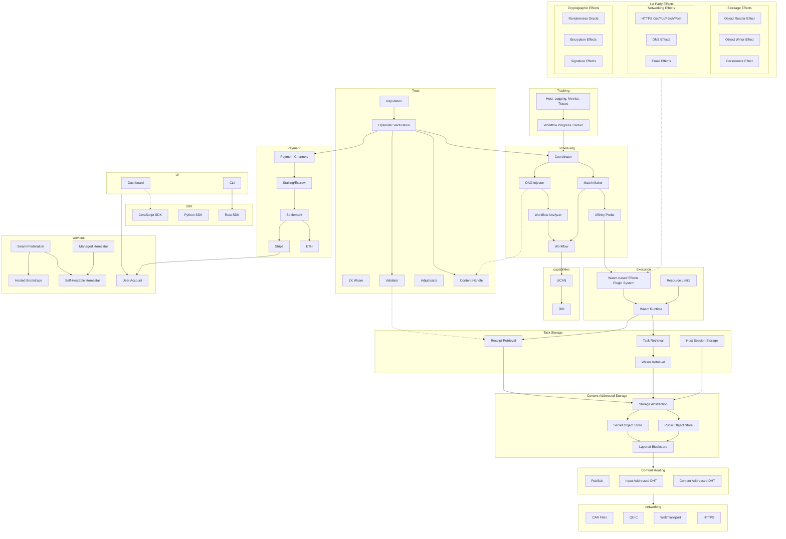

# Homestar Roadmap

I can't even begin to describe just how WIP this is at the moment:

Dependency Graph

```mermaid
flowchart
    subgraph networking
        direction TB

        car[CAR Files]
        quic[QUIC]
        webt[WebTransport]
        https[HTTPS]
    end

    subgraph routing[Content Routing]
        direction TB

        pubsub[PubSub]
        receipt-dht[Input Addressed DHT]
        hash-dht[Content Addressed DHT]
    end
    
    subgraph ca_storage[Content Addressed Storage]
        layered_bs[Layered Blockstore]
        pub_obj_store[Public Object Store]
        priv_obj_store[Secret Object Store]
        storage_abstraction[Storage Abstraction]
    end

    subgraph task_storage[Task Storage]
        receipt_store[Receipt Retrieval]
        task_registry[Task Retrieval]
        wasm_retrieval[Wasm Retrieval]
        host_session_storage[Host Session Storage]
    end

    subgraph execution[Execution]
        wasm_based_plugin_system[Wasm-based Effects Plugin System]
        resource_limits[Resource Limits]
        wasm_execution[Wasm Runtime]
    end

    subgraph scheduling[Scheduling]
        coordinator[Coordinator]
        dag_injector[DAG Injector]
        workflow_static_analyser[Workflow Analyzer]
        workflow[Workflow]
        affinity_probe[Affinity Probe]
        match_maker[Match Maker]
    end

    subgraph tracking[Tracking]
        host_logging_metrics_traces[Host: Logging, Metrics, Traces]
        workflow_progress_tracker[Workflow Progress Tracker]
    end

    subgraph capabilities
        ucan[UCAN]
        did[DID]
    end

    subgraph trust[Trust]
        reputation[Reputation]
        optimistic_verification[Optimistic Verification]
        zk_wasm[ZK Wasm]
        validator[Validator]
        adjudicator[Adjudicator]
        content_handle[Content Handle]
    end

    subgraph payment[Payment]
        staking_escrow[Staking/Escrow]
        payment_channels[Payment Channels]
        settlement[Settlement]
        stripe[Stripe]
        eth[ETH]
    end

    subgraph first_party_effects[1st Party Effects]
        subgraph cryptographic_effects[Cryptographic Effects]
            randomness_oracle_fx[Randomness Oracle]
            encryption_fx[Encryption Effects]
            signature_fx[Signature Effects]
        end

        subgraph networking_effects[Networking Effects]
            https_fx[HTTPS Get/Put/Patch/Post]
            dns_fx[DNS Effects]
            email_fx[Email Effects]
        end

        subgraph store_effects[Storeage Effects]
            block_object_reader_fx[Object Reader Effect]
            block_object_writer_fx[Object Writer Effect]
            persistence_fx[Persistence Effect]
        end
    end

    subgraph services
        user_account[User Account]
        swarm_federation[Swarm/Federation]
        hosted_bootstrap[Hosted Bootstraps]
        managed_homestar[Managed Homestar]
        self_hostable_homestar[Self-Hostable Homestar]
    end

    subgraph sdk[SDK]
        javascript_sdk[JavaScript SDK]
        python_sdk[Python SDK]
        rust_sdk[Rust SDK]
    end

    subgraph ui[UI]
        dashboard[Dashboard]
        cli[CLI]
    end

    pub_obj_store --> layered_bs
    priv_obj_store --> layered_bs

    layered_bs --> routing

    receipt_store --> storage_abstraction
    wasm_retrieval --> storage_abstraction
    host_session_storage ----> storage_abstraction

    storage_abstraction --> pub_obj_store
    storage_abstraction --> priv_obj_store

    task_registry --> wasm_retrieval

    wasm_based_plugin_system --> wasm_execution
    resource_limits --> wasm_execution
    wasm_execution --> task_registry
    wasm_execution --> receipt_store

    coordinator --> match_maker
    coordinator --> dag_injector
    workflow_static_analyser --> workflow
    match_maker --> affinity_probe
    match_maker --> workflow

    affinity_probe ---> wasm_based_plugin_system

    host_logging_metrics_traces --> workflow_progress_tracker
    workflow_progress_tracker --> coordinator

    ucan --> did

    reputation --> optimistic_verification
    optimistic_verification --> coordinator
    optimistic_verification --> content_handle
    optimistic_verification --> validator
    validator -.-> receipt_store

    dag_injector --> workflow_static_analyser
    dag_injector -...-> content_handle
    workflow --> ucan

    optimistic_verification --> payment_channels

    payment_channels --> staking_escrow
    staking_escrow --> settlement
    settlement --> eth
    settlement --> stripe

    first_party_effects -.......-> wasm_based_plugin_system

    user_account
    swarm_federation --> self_hostable_homestar
    swarm_federation --> hosted_bootstrap
    managed_homestar --> self_hostable_homestar
        
    dashboard -.-> javascript_sdk
    cli --> rust_sdk
    ui ----> user_account

    %% zk_wasm --> resource_limits
    stripe --> user_account

    routing --> networking

    https_fx ~~~ block_object_reader_fx
    randomness_oracle_fx ~~~ https_fx
```
